# Service Mesh Platform

Kong API Gateway + Istio service mesh + Apollo GraphQL federation + Keycloak OAuth2 on a local Kind cluster, with ArgoCD GitOps and Buildkite CI.

## Architecture Diagram

```mermaid
graph TB
    subgraph External["External"]
        Browser["Browser / curl"]
        Buildkite["Buildkite CI"]
        Git["Git — main branch"]
        Registry["localhost:5000\nDocker Registry"]
    end

    subgraph Cluster["Kind Cluster (3 nodes)"]

        subgraph KongNS["kong namespace — outside mesh"]
            Kong["Kong Gateway\nJWT validation · Rate limit 60/min\nhostPort :80"]
            KongPlugins["KongPlugin\njwt-auth  rate-limit"]
            GatewayAPI["GatewayClass · Gateway · HTTPRoute\nReferenceGrant in default ns"]
        end

        subgraph KeycloakNS["keycloak namespace"]
            Keycloak["Keycloak\nRealm: service-mesh\nkong client — Authorization Code\nScopes: catalog:read · shipping:read"]
        end

        subgraph DefaultNS["default namespace — Istio mesh · mTLS STRICT (internal)"]
            Apollo["Apollo Router\n★ Envoy sidecar\nforwards Authorization header"]
            Catalog["Catalog\nKotlin / Spring Boot / DGS\n★ Envoy sidecar\nRequestAuthentication · scope: catalog:read"]
            Shipping["Shipping\nGo / gqlgen\n★ Envoy sidecar\nRequestAuthentication · scope: shipping:read"]
        end

        subgraph Platform["platform namespaces"]
            Vault["HashiCorp Vault\nvault namespace"]
            ESO["External Secrets Operator"]
            OPA["OPA / Gatekeeper\nadmission policies"]
        end

        subgraph GitOps["gitops namespace"]
            ArgoCD["ArgoCD\napp-of-apps pattern"]
        end

        subgraph Observability["istio-system"]
            Istiod["Istiod — control plane\ncert management · JWKS cache · sidecar injection"]
            Prometheus["Prometheus"]
            Jaeger["Jaeger — tracing"]
            Kiali["Kiali — mesh viz"]
        end

    end

    %% ── User auth flow ──────────────────────────────────────────────
    Browser -->|"1 · GET token\ngrant_type=password"| Keycloak
    Browser -->|"2 · POST /\nAuthorization: Bearer JWT"| Kong
    Kong -->|"validate RS256 signature"| KongPlugins
    Kong -->|"3 · plain HTTP\n(permissive mTLS from Kong ns)"| Apollo

    %% ── S2S JWT forwarding ─────────────────────────────────────────
    Apollo -->|"4 · mTLS + forwarded JWT\n(Authorization header propagated)"| Catalog
    Apollo -->|"4 · mTLS + forwarded JWT\n(Authorization header propagated)"| Shipping
    Istiod -. "5 · istiod fetches JWKS\nto validate JWT at sidecar" .-> Keycloak

    %% ── Gateway API cross-namespace routing ────────────────────────
    Kong --- GatewayAPI

    %% ── Secrets ────────────────────────────────────────────────────
    Vault -->|"sync via ExternalSecret CRD"| ESO
    ESO -->|"K8s Secret: apollo-credentials"| Apollo
    ESO -->|"K8s Secret: keycloak-credentials"| Keycloak

    %% ── GitOps ─────────────────────────────────────────────────────
    Git -->|"watch · auto-sync"| ArgoCD
    ArgoCD -->|"helm deploy"| Apollo
    ArgoCD -->|"helm deploy"| Catalog
    ArgoCD -->|"helm deploy"| Shipping

    %% ── CI ─────────────────────────────────────────────────────────
    Buildkite -->|"build · push image"| Registry
    Buildkite -->|"update image tag"| Git
    Registry -->|"pull"| Apollo
    Registry -->|"pull"| Catalog
    Registry -->|"pull"| Shipping

    %% ── Mesh control plane ─────────────────────────────────────────
    Istiod -. "inject sidecars · issue certs" .-> Apollo
    Istiod -. "inject sidecars · issue certs" .-> Catalog
    Istiod -. "inject sidecars · issue certs" .-> Shipping
    Prometheus -. "scrape Envoy metrics" .-> Apollo
    Prometheus -. "scrape Envoy metrics" .-> Catalog
    Prometheus -. "scrape Envoy metrics" .-> Shipping
```



## Component Overview

| Component          | Tool                          |
|--------------------|-------------------------------|
| Local K8s          | Kind (1 control-plane + 2 workers) |
| API Gateway        | Kong (Gateway API mode)       |
| Identity Provider  | Keycloak (OAuth2 / OIDC)      |
| Service Mesh       | Istio + Envoy sidecars        |
| GraphQL Federation | Apollo Router                 |
| Subgraph: Catalog  | Kotlin / Spring Boot (DGS)    |
| Subgraph: Shipping | Go (gqlgen)                   |
| Secrets            | HashiCorp Vault + External Secrets Operator |
| Policy             | OPA / Gatekeeper              |
| Observability      | Jaeger, Prometheus, Kiali     |
| GitOps / CD        | ArgoCD (app-of-apps)          |
| Infrastructure     | Terraform                     |
| CI                 | Buildkite                     |

### Infrastructure

- **Kind** — runs a full Kubernetes cluster locally using Docker containers as nodes. Each node is a container, so you get a realistic multi-node cluster without VMs. Destroyed with one command when you're done.
- **Local Docker Registry** — a mini Docker Hub on `localhost:5000`. Services are built and pushed here. Kind nodes pull from it directly over the local Docker network — no internet or Docker Hub account needed.
- **Helm** — package manager for Kubernetes. We use a single shared chart for all our services, with per-service values files to override image, port, resources, etc.

### Traffic Flow

- **Kong API Gateway** — the single entry point for all external traffic. Handles JWT authentication (RS256, issued by Keycloak) and rate limiting (60 req/min). Runs in the `kong` namespace outside the Istio mesh.
- **Apollo Router** — a GraphQL federation gateway. Sits behind Kong and composes a single unified GraphQL API from multiple subgraph services. Clients send one query; Apollo splits it across the right subgraphs.
- **Catalog (Kotlin/Spring Boot)** — a GraphQL subgraph serving product data. Uses Netflix DGS for Apollo-compatible federation.
- **Shipping (Go)** — a GraphQL subgraph serving shipping/delivery data. Uses gqlgen with the Apollo Federation plugin. Kept in Go to demonstrate a polyglot mesh.

#### Kong + Istio: Pattern 1 (Kong outside the mesh)

Kong runs in the `kong` namespace with no Istio sidecar. Application services (Apollo Router, Catalog, Shipping) run in the `default` namespace with Istio sidecars injected.

```
Internet → Kong (kong ns, no sidecar)
               ↓ plain HTTP to apollo-router (default ns)
           Apollo Router (default ns, HAS sidecar)
               ↓ Envoy sidecar accepts plain HTTP (permissive mTLS mode)
               ↓ mTLS enforced for all internal calls
           Catalog / Shipping (default ns, HAS sidecar)
```

Kong sends plain HTTP to Apollo Router. Apollo Router's Envoy sidecar accepts it because Istio runs in **permissive mTLS mode** — it accepts both plain HTTP and mTLS. All service-to-service traffic inside the mesh (Apollo Router → Catalog, Apollo Router → Shipping) is mTLS encrypted.

**Why Pattern 1 over Pattern 2 (Kong inside the mesh):**

| | Pattern 1 (Kong outside) | Pattern 2 (Kong inside) |
|---|---|---|
| **Kong namespace** | `kong` — no sidecar | `kong` — with sidecar |
| **mTLS coverage** | Mesh-internal only | End-to-end including Kong |
| **Complexity** | Simple | Requires strict mTLS config changes |
| **Operational overhead** | Low | Kong + Istio certs to manage |
| **Real-world usage** | Standard production pattern | Used when compliance requires end-to-end mTLS |

Pattern 1 is the standard real-world approach for Kong + Istio. The security boundary at Kong (JWT validation, rate limiting) combined with mTLS inside the mesh is sufficient for most production workloads.

#### Cross-namespace routing: Gateway API over Kubernetes Ingress

The standard Kubernetes Ingress spec does not support cross-namespace backend service references — `backend.service.name` resolves only within the ingress's own namespace. This means an Ingress in the `kong` namespace cannot reference `apollo-router` in the `default` namespace.

**Solution: Gateway API with `HTTPRoute` + `ReferenceGrant`**

Gateway API is the Kubernetes-native successor to Ingress and solves cross-namespace routing properly:

```
GatewayClass (kong ns)      — tells Kong's controller it owns this gateway
Gateway (kong ns)            — defines the listener (port 80)
HTTPRoute (kong ns)          — routing rules, references apollo-router in default ns
ReferenceGrant (default ns)  — explicitly permits the cross-namespace reference
```

The `ReferenceGrant` is created in the **target namespace** (`default`) and acts as an explicit allowlist — only the namespaces and resource types it names can reference services there.

**Key configuration gotchas:**

- `konghq.com/gatewayclass-unmanaged: "true"` is required on the GatewayClass when using the combined `ingress` Helm chart. Without it, KIC tries to provision the Kong proxy lifecycle — but Helm already owns it. This causes the Gateway to stay stuck at `PROGRAMMED: Unknown` forever.
- `konghq.com/plugins` annotations must be on the **HTTPRoute**, not the Gateway — plugin annotations on Gateway objects are not translated in Gateway API mode.
- `controller.ingressController.env.feature_gates: "GatewayAlpha=true"` must be set in Kong's `values.yaml`.

#### Kong Authentication: JWT validation

Kong validates RS256-signed JWTs issued by Keycloak at the gateway — before requests reach Apollo Router.

```
Browser → GET token from Keycloak (password grant or auth code flow)
        → POST / with Authorization: Bearer <token>
        → Kong: validates RS256 signature using Keycloak's public key
        → Kong: checks token not expired (exp claim)
        → Kong: forwards to Apollo Router if valid, returns 401 if not
```

The public key is stored in a Kubernetes Secret (`keycloak-jwt-credential`) in the `kong` namespace. Kong's JWT plugin uses the `iss` claim to look up the credential and verify the signature.

**Why store the public key in Git:**

RS256 is asymmetric — Keycloak signs with its private key (never leaves Keycloak) and anyone can verify with the public key. Storing the public key in Git is equivalent to publishing it, which Keycloak already does at `/auth/realms/service-mesh/protocol/openid-connect/certs`.

#### S2S Authentication: Istio mTLS + JWT (planned)

Service-to-service authentication uses two layers:

1. **mTLS (Istio)** — Apollo Router's Envoy sidecar presents a SPIFFE certificate (`cluster.local/ns/default/sa/apollo-router`) when calling Catalog/Shipping. Catalog/Shipping's `AuthorizationPolicy` allows only the `apollo-router` service account.

2. **JWT (planned)** — Apollo Router fetches a token from Keycloak using the `s2s` client (Client Credentials flow) and attaches it to subgraph requests. Catalog/Shipping's Istio `RequestAuthentication` validates the token at the sidecar.

### Service Mesh

- **Istio** — service mesh that injects an Envoy sidecar proxy into every pod. All service-to-service traffic flows through these sidecars, giving you mTLS encryption, traffic control, and observability without changing application code.
- **Envoy sidecars** — transparent proxies injected by Istio into each pod. They intercept all inbound/outbound traffic and enforce mTLS, circuit breaking, retries, and timeouts.

#### How traffic flows through the mesh

```
                        INBOUND (e.g. Kong → Apollo Router)
                        ─────────────────────────────────────
Kong sends to apollo-router:4000
  → request arrives at Apollo Router pod's network
  → iptables intercepts BEFORE it reaches the app container
  → Envoy sidecar receives it, terminates mTLS, applies policies
  → Envoy forwards to localhost:4000 inside the same pod
  → Apollo Router receives the plain HTTP request

                        OUTBOUND (e.g. Apollo Router → Catalog)
                        ─────────────────────────────────────────
Apollo Router sends to catalog:4001
  → iptables intercepts the outgoing traffic
  → Envoy sidecar encrypts it with mTLS
  → sends to Catalog pod's Envoy sidecar
  → Catalog's Envoy decrypts, forwards to localhost:4001
  → Catalog app receives the plain HTTP request
```

#### mTLS modes: permissive vs strict

| | Permissive (default) | Strict |
|---|---|---|
| **Accepts plaintext** | Yes — both plain HTTP and mTLS | No — mTLS only |
| **Sidecar-to-sidecar** | Encrypted (mTLS) | Encrypted (mTLS) |
| **Non-mesh to mesh** | Works (plain HTTP accepted) | Rejected (no valid cert) |
| **Use case** | Migration phase, or when non-mesh components (Kong) talk to mesh services | Full production lockdown |

Currently we use **permissive** globally — required because Kong (no sidecar) sends plain HTTP to Apollo Router. Catalog and Shipping use **STRICT** via per-service `PeerAuthentication` — all traffic between them must be mTLS.

#### Service accounts as mesh identity

Each service gets its own Kubernetes ServiceAccount. Istio issues SPIFFE certificates based on the service account, which is what `AuthorizationPolicy` uses to control access:

| Service | Service Account | SPIFFE Identity |
|---|---|---|
| Catalog | `catalog` | `cluster.local/ns/default/sa/catalog` |
| Shipping | `shipping` | `cluster.local/ns/default/sa/shipping` |
| Apollo Router | `apollo-router` | `cluster.local/ns/default/sa/apollo-router` |

#### NetworkPolicy: cross-namespace label gotchas

- A bare `podSelector` in a NetworkPolicy only matches pods in the **same namespace**. To allow Kong (in `kong` ns) to reach Apollo Router (in `default` ns), both `namespaceSelector` AND `podSelector` must be combined in the same `from` entry (AND logic). Two separate entries would be OR logic — too permissive.
- Helm-deployed services use `app.kubernetes.io/name` labels, not plain `app:`. Kong uses `app: kong-gateway` (non-standard label set by the Kong chart).

#### Circuit breaker: Istio vs application-level

| | Istio (Envoy) | App-level (Resilience4j) |
|---|---|---|
| **Triggers on** | Connection count, pending requests, consecutive 5xx | Latency, error rate, slow call %, custom conditions |
| **Fallback** | Returns 503, app must handle it | Can return cached data, defaults, or call alternative service |
| **Code changes** | None — configured as YAML (DestinationRule) | Requires code in every service |

### Observability

- **Jaeger** — distributed tracing. Shows the full journey of a request across services.
- **Prometheus** — metrics collection. Scrapes latency, error rate, and throughput data from Envoy sidecars automatically.
- **Kiali** — visual dashboard for the mesh. Shows a live topology map with traffic flow, health status, and mTLS status.

### Platform

- **cert-manager** — automates TLS certificate creation and renewal.
- **OPA/Gatekeeper** — policy engine that enforces rules on what can be deployed (e.g., all pods must have resource limits).
- **External Secrets Operator** — syncs secrets from HashiCorp Vault into Kubernetes Secrets. Vault path → ExternalSecret CRD → K8s Secret → pod env var.

### Secrets Management

```
Vault (dev mode)                  external-secrets            K8s Secret
secret/data/apollo-router    →    ExternalSecret CRD    →    apollo-credentials   →   pod env APOLLO_KEY
secret/data/keycloak         →    ExternalSecret CRD    →    keycloak-credentials →   pod env KEYCLOAK_ADMIN
```

Both secrets are seeded automatically by `null_resource.vault_init` in Terraform on cluster creation.

### Infrastructure as Code

**Terraform** provisions the entire platform with a single `terraform apply`:

| Terraform manages | ArgoCD manages |
|---|---|
| Kind cluster + local registry | Service deployments (catalog, shipping, apollo-router) |
| Istio control plane | Istio per-service config (DestinationRules, VirtualServices) |
| Kong + Gateway API CRDs | Helm releases for application services |
| Keycloak | |
| cert-manager, OPA, Vault, External Secrets | |
| Observability (Jaeger, Prometheus, Kiali) | |
| ArgoCD install + root app bootstrap | |

### CI/CD

- **ArgoCD** — GitOps continuous delivery. Watches this Git repo and automatically syncs Kubernetes manifests on every push.
- **Buildkite** — continuous integration. A parent pipeline detects which services changed and dynamically uploads child pipelines. Each child runs lint, tests, builds Docker images, pushes to `localhost:5000`, and updates image tags in `charts/releases/` — which triggers ArgoCD to deploy.

## Prerequisites

- [Docker](https://docs.docker.com/get-docker/)
- [Kind](https://kind.sigs.k8s.io/docs/user/quick-start/#installation)
- [kubectl](https://kubernetes.io/docs/tasks/tools/)
- [Helm](https://helm.sh/docs/intro/install/)
- [Terraform](https://developer.hashicorp.com/terraform/install) (>= 1.5)
- [istioctl](https://istio.io/latest/docs/setup/getting-started/#download)
- JDK 17+ (for Catalog service)
- Go 1.22+ (for Shipping service)
- [Rover CLI](https://www.apollographql.com/docs/rover/getting-started/) (for composing the supergraph schema)

## Quick Start

```bash
cd terraform
terraform init
terraform apply
```

After `terraform apply` completes, ArgoCD deploys the application services from Git automatically.

```bash
# Get a token from Keycloak (port-forward Keycloak first: kubectl port-forward svc/keycloak-keycloakx-http -n keycloak 8082:80)
curl -s -X POST http://localhost:8082/auth/realms/service-mesh/protocol/openid-connect/token \
  -d 'grant_type=password' -d 'client_id=kong' \
  -d 'username=testuser' -d 'password=testuser' \
  -d 'scope=catalog:read shipping:read'

# Query through Kong with JWT
curl -X POST http://localhost:80/ \
  -H "Authorization: Bearer <token>" \
  -H 'Content-Type: application/json' \
  -d '{"query":"{ products { id name } }"}'

# Access ArgoCD UI
kubectl port-forward svc/argocd-server -n argocd 8080:443
# Password: kubectl get secret argocd-initial-admin-secret -n argocd -o jsonpath='{.data.password}' | base64 -d
```

### After cluster recreation: update JWT public key

Keycloak generates a new RS256 key pair on every fresh deployment. After `terraform apply`:

```bash
# 1. Port-forward Keycloak
kubectl port-forward svc/keycloak-keycloakx-http -n keycloak 8082:80

# 2. Get the x5c certificate from JWKS
curl -s http://localhost:8082/auth/realms/service-mesh/protocol/openid-connect/certs

# 3. Extract the public key (replace X5C_VALUE with the x5c field value)
echo "<X5C_VALUE>" | base64 -d | openssl x509 -inform DER -pubkey -noout

# 4. Update kong/plugins/jwt.yaml with the new public key
# 5. kubectl apply -f kong/plugins/jwt.yaml
```

## Observability Dashboards

| Tool | Command | What it shows |
|------|---------|---------------|
| Kiali | `istioctl dashboard kiali` | Mesh topology, traffic flow, mTLS status |
| Jaeger | `istioctl dashboard jaeger` | Distributed traces across services |
| Prometheus | `istioctl dashboard prometheus` | Raw metrics (latency, error rate, throughput) |
| Keycloak | `kubectl port-forward svc/keycloak-keycloakx-http -n keycloak 8082:80` | Identity provider admin |
| ArgoCD | `kubectl port-forward svc/argocd-server -n argocd 8080:443` | GitOps sync status |

## Teardown

```bash
cd terraform && terraform destroy
```

## Project Structure

```
service-mesh-platform/
  terraform/                # Infrastructure as Code — single apply provisions everything
  kind/                     # Cluster config and setup script
  services/
    catalog/                # Kotlin/Spring Boot GraphQL subgraph
    shipping/               # Go GraphQL subgraph
  apollo/                   # Apollo Router (supergraph federation)
  charts/
    service/                # Shared Helm chart (Deployment, HPA, PDB, NetworkPolicy, Istio config)
    releases/               # Per-service Helm values overrides
  istio/                    # Istio mesh config (telemetry, circuit breaker)
  kong/                     # Kong gateway config, plugins, Gateway API resources
    ingress.yaml            # GatewayClass, Gateway, HTTPRoute, ReferenceGrant
    plugins/                # rate-limit.yaml, jwt.yaml (KongPlugin, KongConsumer, Secret)
    values.yaml             # Kong Helm values (GatewayAlpha=true, hostPort config)
  keycloak/                 # (managed by Terraform/Helm)
  platform/
    cert-manager/           # ClusterIssuer
    opa/                    # Gatekeeper constraint templates and constraints
    external-secrets/       # ClusterSecretStore, ExternalSecret CRDs
  argocd/                   # ArgoCD Application CRDs (app-of-apps pattern)
  observability/            # Jaeger, Prometheus, Kiali manifests (local copies)
  .buildkite/               # CI pipelines (parent + per-service child pipelines)
```
